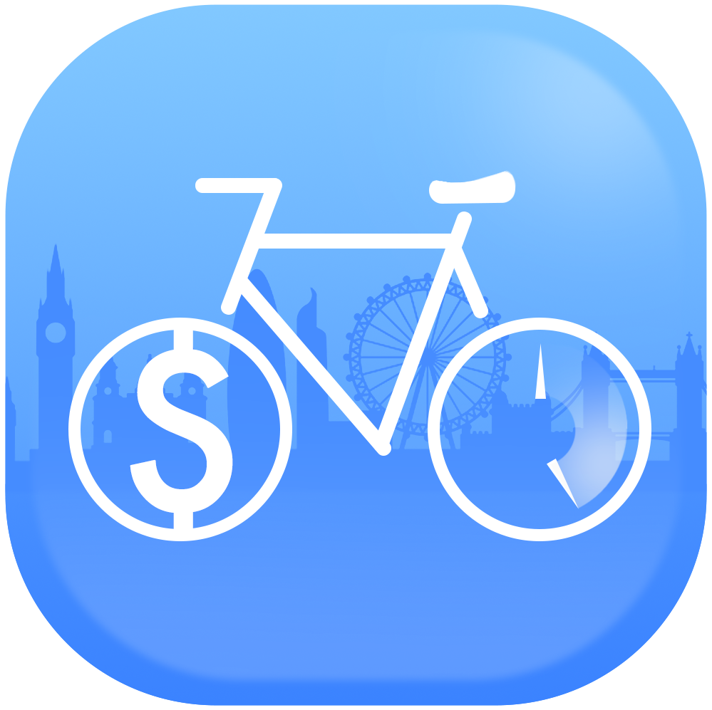

<h1 align="center">TourBi</h1>
<p align="center">

<a href="https://youtu.be/t1VqzWKwHyQ">Video Demo</a>
                                                     </p>
<h3 align="center">A journey planning app that uses a bicycle hire scheme for tourists</h4>

<p>
  
  
  
  
</p>

# Android

<h3 align="center">Google Maps</h3>

1. Set the `minSdkVersion` in `android/app/build.gradle`:

```groovy
android {
    defaultConfig {
        minSdkVersion 21
        targetSdkVersion 30
    }
}
```

This means that app will only be available for users that run Android SDK 20 or higher.

2. Specify your API key in the application manifest `android/app/src/main/AndroidManifest.xml`:

```xml

<manifest ...
<application ...
<meta-data android:name="com.google.android.geo.API_KEY"
           android:value="YOUR KEY HERE"/>
```

<h3 align="center">Map Box</h3>

1. Mapbox APIs and vector tiles require a Mapbox account and API access token. Add your token in strings.xml file of
   your android apps res/values/ path. The string key should be "mapbox_access_token". You can obtain an access token
   from the [Mapbox account page](https://account.mapbox.com/access-tokens/).

```xml
<?xml version="1.0" encoding="utf-8"?>
<resources>
    <string name="app_name">Navigation map</string>
    <string name="mapbox_access_token" translatable="false">ADD_MAPBOX_ACCESS_TOKEN_HERE</string>
    <string name="user_location_permission_explanation">This app needs location permissions to show its functionality.
    </string>
    <string name="user_location_permission_not_granted">You didn\'t grant location permissions.</string>
</resources>
```

2. Add the following permissions to the app level Android Manifest

```xml

<manifest>
    ...
    <uses-permission android:name="android.permission.ACCESS_COARSE_LOCATION"/>
    <uses-permission android:name="android.permission.ACCESS_FINE_LOCATION"/>
    <uses-permission android:name="android.permission.ACCESS_NETWORK_STATE"/>
    ...
</manifest>
```

3. Add the MapBox Downloads token with the ```downloads:read``` scope to your gradle.properties file in Android folder
   to enable downloading the MapBox binaries from the repository. To secure this token from getting checked into source
   control, you can add it to the gradle.properties of your GRADLE_HOME which is usually at $USER_HOME/.gradle for Mac.
   This token can be retrieved from your [MapBox Dashboard](https://account.mapbox.com/access-tokens/). You can review
   the [Token Guide](https://docs.mapbox.com/accounts/guides/tokens/) to learn more about download tokens

```text
MAPBOX_DOWNLOADS_TOKEN=sk.XXXXXXXXXXXXXXX
```

After adding the above, your gradle.properties file may look something like this:

```text
org.gradle.jvmargs=-Xmx1536M
android.useAndroidX=true
android.enableJetifier=true
MAPBOX_DOWNLOADS_TOKEN=sk.epe9nE9peAcmwNzKVNqSbFfp2794YtnNepe9nE9peAcmwNzKVNqSbFfp2794YtnN.-HrbMMQmLdHwYb8r
```

# iOS

<h3 align="center">Google Maps</h3>

This plugin requires iOS 9.0 or higher. To set up, specify your API key in the application
delegate `ios/Runner/AppDelegate.m`:

```objectivec
#include "AppDelegate.h"
#include "GeneratedPluginRegistrant.h"
#import "GoogleMaps/GoogleMaps.h"

@implementation AppDelegate

- (BOOL)application:(UIApplication *)application
    didFinishLaunchingWithOptions:(NSDictionary *)launchOptions {
  [GMSServices provideAPIKey:@"YOUR KEY HERE"];
  [GeneratedPluginRegistrant registerWithRegistry:self];
  return [super application:application didFinishLaunchingWithOptions:launchOptions];
}
@end
```

Or in your swift code, specify your API key in the application delegate `ios/Runner/AppDelegate.swift`:

```swift
import UIKit
import Flutter
import GoogleMaps

@UIApplicationMain
@objc class AppDelegate: FlutterAppDelegate {
  override func application(
    _ application: UIApplication,
    didFinishLaunchingWithOptions launchOptions: [UIApplication.LaunchOptionsKey: Any]?
  ) -> Bool {
    GMSServices.provideAPIKey("YOUR KEY HERE")
    GeneratedPluginRegistrant.register(with: self)
    return super.application(application, didFinishLaunchingWithOptions: launchOptions)
  }
}
```

<h3 align="center">Map Box</h3>

1. Go to your [Mapbox account dashboard](https://account.mapbox.com/) and create an access token that has
   the `DOWNLOADS:READ` scope. **PLEASE NOTE: This is not the same as your production Mapbox API token. Make sure to
   keep it private and do not insert it into any Info.plist file.** Create a file named `.netrc` in your home directory
   if it doesn’t already exist, then add the following lines to the end of the file:
   ```
   machine api.mapbox.com
     login mapbox
     password PRIVATE_MAPBOX_API_TOKEN
   ```
   where _PRIVATE_MAPBOX_API_TOKEN_ is your Mapbox API token with the `DOWNLOADS:READ` scope.

1. Mapbox APIs and vector tiles require a Mapbox account and API access token. In the project editor, select the
   application target, then go to the Info tab. Under the “Custom iOS Target Properties” section, set `MBXAccessToken`to
   your access token. You can obtain an access token from
   the [Mapbox account page](https://account.mapbox.com/access-tokens/).

1. In order for the SDK to track the user’s location as they move along the route,
   set `NSLocationWhenInUseUsageDescription` to:
   > Shows your location on the map and helps improve OpenStreetMap.

1. Users expect the SDK to continue to track the user’s location and deliver audible instructions even while a different
   application is visible or the device is locked. Go to the Capabilities tab. Under the Background Modes section,
   enable “Audio, AirPlay, and Picture in Picture” and “Location updates”. (Alternatively, add the `audio`and `location`
   values to the `UIBackgroundModes` array in the Info tab.)

## Plugins

The plugins used in this project are:

* [google_maps_flutter](https://pub.dev/packages/google_maps_flutter)
* [tfl_api_client](https://pub.dev/packages/tfl_api_client)
* [flutter_mapbox_navigation](https://pub.dev/packages/flutter_mapbox_navigation)
* [flutter_polyline_points](https://pub.dev/packages/flutter_polyline_points)
* [cloud_firestore](https://pub.dev/packages/cloud_firestore)
* [crypto](https://pub.dev/packages/crypto)
* [cupertino_icons](https://pub.dev/packages/cupertino_icons)
* [firebase_auth](https://pub.dev/packages/firebase_auth)
* [firebase_core](https://pub.dev/packages/firebase_core)
* [flutter_google_places_hoc081098](https://pub.dev/packages/flutter_google_places_hoc081098)
* [flutter_spinkit](https://pub.dev/packages/flutter_spinkit)
* [google_api_headers](https://pub.dev/packages/google_api_headers)
* [google_maps_webservice](https://pub.dev/packages/google_maps_webservice)
* [nanoid](https://pub.dev/packages/nanoid)
* [provider](https://pub.dev/packages/provider)
* [uuid](https://pub.dev/packages/uuid)
* [avatars](https://pub.dev/packages/avatars/versions/3.0.0)
* [animated_bottom_navigation_bar](https://pub.dev/packages/animated_bottom_navigation_bar)
* [geolocator](https://pub.dev/packages/geolocator)
* [auto_animated](https://pub.dev/packages/auto_animated)
* [google_fonts](https://pub.dev/packages/google_fonts)
* [animations](https://pub.dev/packages/animations)
* [location](https://pub.dev/packages/location)
* [getwidget](https://pub.dev/packages/getwidget)
* [rounded_loading_button](https://pub.dev/packages/rounded_loading_button)
* [flutter_native_splash](https://pub.dev/packages/flutter_native_splash)
* [flutter_launcher_icons](https://pub.dev/packages/flutter_launcher_icons)
* [introduction_screen](https://pub.dev/packages/introduction_screen)
* [mockito](https://pub.dev/packages/mockito)
* [fake_cloud_firestore](https://pub.dev/packages/fake_cloud_firestore)
* [firebase_auth_mocks](https://pub.dev/packages/firebase_auth_mocks)
* [mock_data](https://pub.dev/packages/mock_data)

## Creators

<table>
  <tr>
    <td align="center">
<a href="https://github.com/Zane-Mehdi"><br /><sub><b>
Zane Mehdi</td>

<td align="center">
<a href="https://github.com/MKKhan999"><br /><sub><b>
Musab Khan</td>

<td align="center">
<a href="https://github.com/K20068812"><br /><sub><b>
Amman Kiani</td>

<td align="center">
<a href="https://github.com/rohitProduction"><br /><sub><b>
Rohit Pun</td>

<td align="center">
<a href="https://github.com/TaseenR"><br /><sub><b>
Taseen (Taz) Rahman</td>

<td align="center">
<a href="https://github.com/SamadurR"><br /><sub><b>
Samadur (Samad) Rahman</td>

<td align="center">
<a href="https://github.com/DawudOsman"><br /><sub><b>
Dawud Osman</td>

<td align="center">
<a href="https://github.com/DxnielKS"><br /><sub><b>
Daniel Saisani</td>
</tr>
</table>

